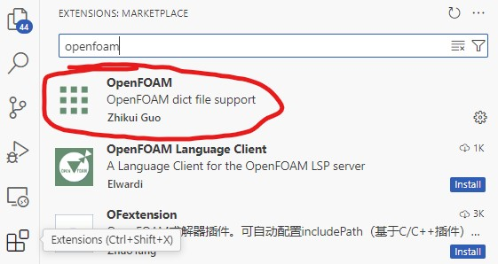
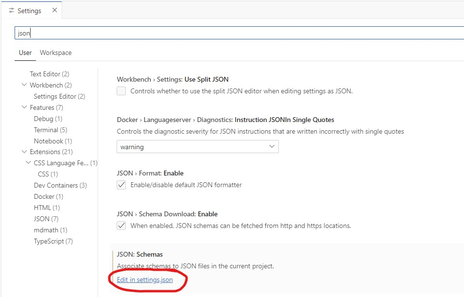
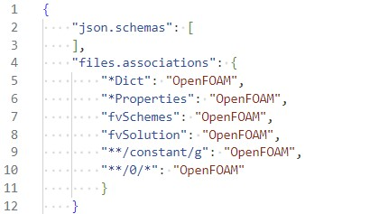
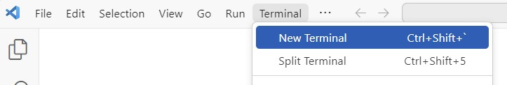
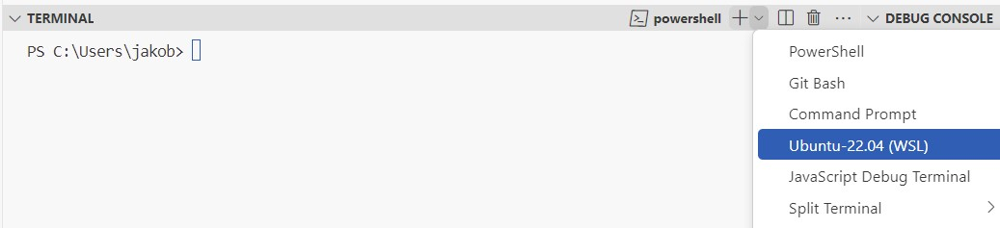

# Installing and setting up Visual Studio Code Guide for OpenFOAM

In this guide we will install and setup Visual Studio Code for our OpenFOAM workflow.

## Step 1: Installing Visual Studio Code
**1a)** First, install the text editor [Visual Studio Code](https://code.visualstudio.com).

## Step 2: Associate OpenFOAM files

**2a)** Associate OpenFOAM files by installing the OpenFOAM extension by Zhikui Guo in the left pane.



**2b)** Click the OpenFOAM extension and copy the lines:

```
"files.associations": {
    "*Dict": "OpenFOAM",
    "*Properties": "OpenFOAM",
    "fvSchemes": "OpenFOAM",
    "fvSolution": "OpenFOAM",
    "**/constant/g": "OpenFOAM",
    "**/0/*": "OpenFOAM"
    }
```

**2c)** Open the ``settings.json`` file by going File -> Preferences -> Settings. Then search for ``json`` and edit the ``settings.json`` file.



**2d)** Within this file, add the lines you copied in 2d (leave any content that is already there). Remember to save after you add the lines:



## Step 3: Verify everything works

**3a)** Open a new Ubuntu terminal. In the menu choose Terminal -> New terminal.



**3b)** In the newly opened terminal, use the dropdown menu to choose Ubuntu (WSL).



To confirm you opened a WSL terminal a green text should appear:

